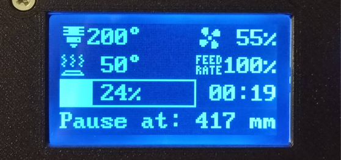
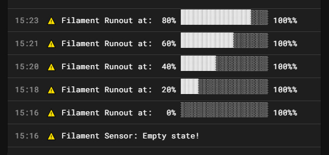

# Sandworm 3D Printer - Klipper Macros

```
Author: Zachar Čuřík
Launch Date: Q2 2025
Code Name: Sandworm Mach3 Y2025 GS556 (*game_save: "556") - (†game_over_date: "unknown")
Project by: Urobotos Coding
```

<br>

> [!NOTE]
> These **Klipper macros** are part of the instructions and their continuation for building the **Sandworm printer** on the
> [**Printables.com**](https://www.printables.com/model/976901-sandworm-3d-printer) website,
> where (in addition to the instructions) you can also find the **3D printable models** needed to build this printer.

<br>

### ✂️ A modified `mainsail.cfg` file called `mainsail_custom.cfg` is used:
The Sandworm printer uses a modified `mainsail.cfg` file called `mainsail_custom.cfg`, the redirected include is listed in `printer.cfg`, so no manual edits are needed. This is provided for information only.

**Modifications include:**
- **Fan Control**: The part cooling fan turns off during `PAUSE` and then resumes to its previous speed when `RESUME` is triggered.<br>
   - Benefit: The fan does not run unnecessarily during a pause, which can be extended when using a filament sensor for runout detection.<br>

- **Nozzle Priming After Pause**: The `point_unretract` macro is executed when printing resumes after a pause.<br>
   - How it works: The print head returns to the paused position and performs a small filament extrusion to refill the nozzle.<br>
   - Benefit: Prevents gaps in the print caused by filament leakage during the pause.<br><br>


### 📂 Copy & Paste Config Files:
- Copy all content from the `Sandworm/config` folder and paste them into your printer’s config directory.
  - Example path: `home/biqu/printer_data/config/`
  - Choose Yes if prompted to overwrite default `printer.cfg`.

- Alternatively, you can clone only the necessary configuration files using: <br>
  ```
  git clone --depth 1 --filter=blob:none --sparse https://github.com/Urobotos/Sandworm.git cd Sandworm git sparse-checkout set config cp -r config/* ~/printer_data/config/
  ```
  - *This `git clone` method ensures that only the `config/` folder is downloaded, preventing unnecessary files from being copied into `printer_data/config/`*<br>

  
- Restart your printer for the first **Sandworm** launch. Then continue with the next steps in this README.md to complete all necessary settings.
 
<br>

### ♻️ Automatic Updates for Sandworm Configuration:
To enable easy updates for the Sandworm configuration and macros, you can set up automatic updates via the Moonraker Update Manager. Simply add the following block to your `moonraker.conf` file:
```
[update_manager Sandworm]
type: git_repo
origin: https://github.com/Urobotos/Sandworm.git
path: ~/Sandworm
primary_branch: main
managed_services: klipper
install_script: install.sh
version: ~/Sandworm/version.txt
```
With each update, the new version will be downloaded to `~/Sandworm`, and then the `install.sh` script will automatically move the necessary files to `~/printer_data/config/`

<br>

### 🔌 Remote Power Control via Relay:
A complete setup guide by `tinntbg`, with more wiring options about **Auto Power Off** macros, can be found in his Github repository:  
[Auto Power Off Klipper](https://github.com/tinntbg/auto-power-off-klipper) <br>

To enable relay-based power control, add the following to your `moonraker.conf` file:<br>

```
[power printer]
type: gpio
pin: gpiochip0/gpio72               # Can be reversed with "!", (Bigtreetech PI V1.2 GPIO pin PC8)
initial_state: off
off_when_shutdown: True             # Turn off power on shutdown/error
locked_while_printing: True         # Prevent power-off during a print
restart_klipper_when_powered: True
restart_delay: 1
bound_service: klipper              # Ensures Klipper service starts/restarts with power toggle
```
**User management of printer ON-OFF:**
The printer power ON-OFF itself is controlled via the Mainsail interface. The included **Auto Power Off** macro serves as a safe temperature shutdown of the printer at the end of printing, It is controlled using two macro buttons: `ACTIVATE_POWER_OFF` and `DEACTIVATE_POWER_OFF` during printing, or by direct writing `ACTIVATE_POWER_OFF` in end_gcode. <br>
(The power off buttons will be set up later in this guide, along with the other macro buttons).

<br>

### 🎞️ Filament Runout Sensor & `runout_distance` Macro:
- **Description**: A configurable distance delay before `PAUSE` is triggered when the filament sensor is activated.
- **Purpose**: Saves filament by allowing extra material to be used before pausing.
- **Setup Instructions**:<br>
  Measure your PTFE tube length (from filament sensor to extruder gear, include a ~100mm buffer for manual filament removal from extruder gear).<br>
  
- **To set the measured value (Two option):**
  - **In the LCD menu:** `Menu → Setup → Filament sens. → Choose:`
      - **Extension:** `ON/OFF`:  
          Where ON = Pause with extension, OFF = Pause will be performed immediately when the Filament Runout is triggered.
      - **Distance:** `930`mm :   
          Adjust `Distance` to: `Your_measured_value_in_mm` (Default: 930mm, adjustment: 10 mm per step, with auto-save function on click).
         
  - **Or directly by editing the variables.cfg file:**  
      - In `variablas.cfg → runout_distance = 930`, change `930` to: Your measured value in mm.

<br>

- The macro contains a **Countdown** in mm for the LCD display and a **Progress Bar** (every 20%) for the Mainsail console:
<p align="center" width="100%">
    
    
</p>
<br>

### 🌐 Language Selection:
The LCD menu and user-defined macros support multiple languages (not included in Klipper native macros).<br>
To change the language (Two option):
- **In the LCD Menu**: `Menu → Setup → Language → Choose: English, Cestina, Deutsch`
   
- **Or in the Mainsail console using a g-code macro:**
   - **English:**
     ```
     SET_MENU_LANGUAGE LANGUAGE=1
     ```
   - **Czech:**
     ```
     SET_MENU_LANGUAGE LANGUAGE=2
     ```
   - **German:**
     ```
     SET_MENU_LANGUAGE LANGUAGE=3
     ```
<br>

### 🖱️ Custom Macro Buttons in Mainsail:
Find the macro names below and add them as buttons in **Mainsail**:

- **Movement (Hidden during prints)**:
  - `Temp_Homing`
  - `steppers_off`
  - `e_stepper_off`
  - `Park_Toolhead`

- **Filament (Hidden during prints)**:
  - `FILAMENT_LOAD`  *(Customizable temperature button, default: 200°C for PLA)*
  - `FILAMENT_UNLOAD` *(Customizable temperature button, default: 200°C for PLA)*
  - `M600`
  - `Nozzle_Clean` *(Uses brush)*
  - `e_stepper_off`

- **Chamber Lights (Always visible)**:
  - `lights_ON_OFF` *(Toggle ON/OFF button based on previous state)*
  - `lights_max` *(Sets the chamber lighting to maximum brightness)*
  - `Extruder_LED_ON_OFF` *(Toggle ON/OFF button based on previous state)*
  - `Display_LED_ON_OFF` *(Toggle ON/OFF button based on previous state)*

- **Calibration (Hidden during prints & pauses)**:
  - `Z_ENDSTOP_CALIBRATE_01`
  - `PROBE_CALIBRATE_02`
  - `Z_TILT_ADJUST_03`
  - `BED_MESH_CALIBRATE_04`

- **Print adjustment (Hidden during standby/ready)**:
  - `ACTIVATE_POWER_OFF`
  - `DEACTIVATE_POWER_OFF`
  - `SET_PAUSE_AT_LAYER`
  - `SET_PAUSE_NEXT_LAYER`

<br>

### 🏁 PrusaSlicer - START & END Gcodes:
In **PrusaSlicer**, insert the following G-code snippets into the `Start G-codes` and `End G-codes` sections:

#### 🟢 Start G-codes:
```gcode
SET_PRINT_STATS_INFO TOTAL_LAYER=[total_layer_count]
CLEAR_PAUSE
BED_MESH_CLEAR
start_gcode BED_TMP=[first_layer_bed_temperature] EXT_TMP=[first_layer_temperature] CHAMBER_TMP=[chamber_temperature] CHAMBER_MIN_TMP=[chamber_minimal_temperature]
```

#### 🔴 End G-codes:
```gcode
end_gcode
```

#### About `CHAMBER_TMP` and `CHAMBER_MIN_TMP` Parameters:
These two parameters are set via **PrusaSlicer**:
- **`CHAMBER_TMP:`** Sets the automatic chamber temperature at which the **Cooling/Filtration Exhaust fans** activate (useful for heat-sensitive filaments like PLA).
- **`CHAMBER_MIN_TMP:`** Ensures the chamber temperature is above a minimum threshold before starting the print. If the temperature is too low, the printer **pauses** and uses the **heated bed at 100°C** to warm the chamber until it reaches the required value (especially useful for filaments prone to warping, such as ABS, PETG, etc.).

#### Where to Find These Parameters for Editing in PrusaSlicer:
- **For automatic Cooling/Filtration:** `Filament Profile → Temperature → Chamber → Nominal: YOUR_VALUE °C`
- **To Preheat the Chamber Before Printing:** `Filament Profile → Temperature → Chamber → Minimum: YOUR_VALUE °C`

>📌 **Tip:** You can set different values for different filaments or completely disable temperature automation for a specific filament by `0`
<br>

> [!NOTE]
> Always set the **minimum chamber temperature** with respect to ambient conditions. The macro relies on ```TEMPERATURE_WAIT``` (similar to M109 for the hotend),
> meaning the printer **pauses all commands** during this phase. If needed, you can cancel the wait loop early by using an **Emergency Stop** and restarting the print with a different chamber temperature setting.
>
> Example chamber temperatures on Sandworm printer (after ~1 hour of printing):
> - Bed: 60°C | Ambient: 25°C | Chamber: 41°C
> - Bed: 95°C | Ambient: 20°C | Chamber: 46°C
> - Bed: 50°C | Ambient: 12°C | Chamber: 28°C

<br>

### 📡 Proximity Inductive Probe SN-04 PNP and Initial Z Homing:
For accurate **Z homing**, it's recommended to **preheat the nozzle** to prevent residual filament from interfering with the probe. 

#### Why Preheat the Nozzle?
- Especially after printing is complete, during nozzle cooling, **some filament may leak out** and solidify at the tip of the nozzle. If this filament remains after cooling, it can interfere with homing.
- **Longer filament strands** may bend harmlessly when contacting the **SN-04 probe**, but **short and hardened pieces** could lead to inaccurate measurements or even slight displacement of the probe itself.
- The **SN-04 inductive probe detects the brass nozzle** at **Z ≈ 0.6 - 0.7mm from the bed**, provided the probe is **aligned with the PEI sheet**. The nozzle itself remains **≈1mm away from the probe sensor**, which has a recessed detection point.
- **Different nozzle materials** (e.g., **carbide nozzles**) may cause the probe to trigger at slightly different heights **due to variations in electromagnetic properties**, meaning detection may occur **earlier, at a greater distance from the PEI sheet**.

#### Solution: Automatic Nozzle Preheating
Instead of requiring manual cleaning of the nozzle, the **Sandworm printer automates this process**. The recommended solution is to **preheat the nozzle remotely before initiating Z homing**. This softens any residual filament, allowing it to deform harmlessly when making contact with the probe, ensuring accurate homing.

#### How Does It Work?
1. The **nozzle is gently preheated** to a low temperature (e.g., **100°C**) before homing.
2. Any residual filament **bends** rather than obstructing the probe.
3. The nozzle **immediately cools** after homing, keeping the filament in its deformed shape for future homing cycles.
4. Subsequent homing operations can proceed normally, even with residual filament.

#### Built-in Macros for Z Homing
The **Sandworm printer** includes an automatic `Temp_Homing` macro that:
1. **Preheats the nozzle slightly** before performing XYZ homing.
2. **Prevents filament from interfering with the probe.**
3. **Is integrated into multiple processes:**
   - **Start G-codes** (before every print)
   - **Nozzle Cleaning** (via brush, only when the axis is not homed)
   - **As a clickable** `Temp_Homing` **macro in the Mainsail console every time the printer starts**<br><br>


### ♘ Sandworm (Non-Print) Movements:
The Sandworm printer in the macros uses a **Chess Knight Movement Style** for non-printing movements (no diagonal movements), 
which is optimal for Core XY printers and in which both core XY motors are engaged and produces less noise.<br><br>


### 💡 RGB Lights Adjustment and SET_LED rename Macro:
The Sandworm printer brings a custom-made `SET_LED rename` macro, its main advantage is:<br>
Persistent SAVING of all configured lights, ensuring that their states are restored after a printer restart.<br>

The `SET_LED rename` macro introduces also a new RGB(W) memory feature:<br>
You can adjust the R, G, B, (W) values for a specific neopixel light individually, without resetting the other colors.<br><br>


### Others:
### 🛠️ Klipper Adaptive Meshing Purging (KAMP):
A great feature by `Kyleisah` to calibrate only the printed area: [Klipper Adaptive Meshing Purging](https://github.com/kyleisah/Klipper-Adaptive-Meshing-Purging)

### 🤝 Contributing
Contributions are welcome! If you'd like to contribute, follow the [CONTRIBUTING.md](./CONTRIBUTING.md) guidelines.

### 📜 A List (Tree) of All Macro Names:
With a short description can be found here: [Tree of Macros.md](./Tree_of_Macros.md)<br><br>


<hr>
✌️ That's it, your journey has come to an end! Thank you for your patience and for following the guide up to this point. And remember, in the Urobotos lair, every ending is the beginning of a whole new journey... enjoy printing, the game has begun!<br><br>

<p align="center" width="100%">
    
</p>


